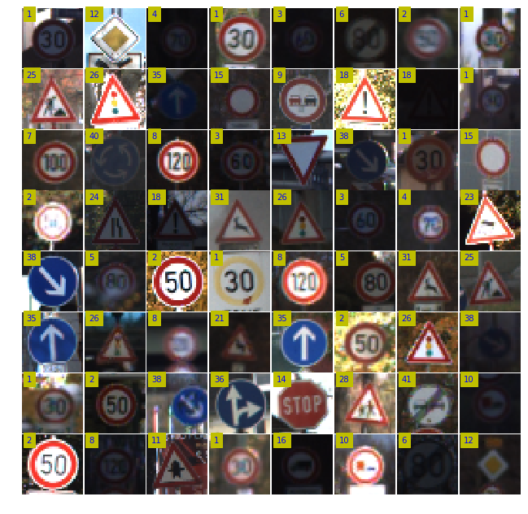
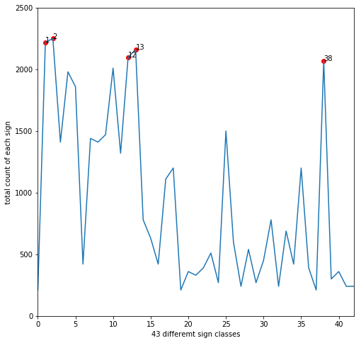
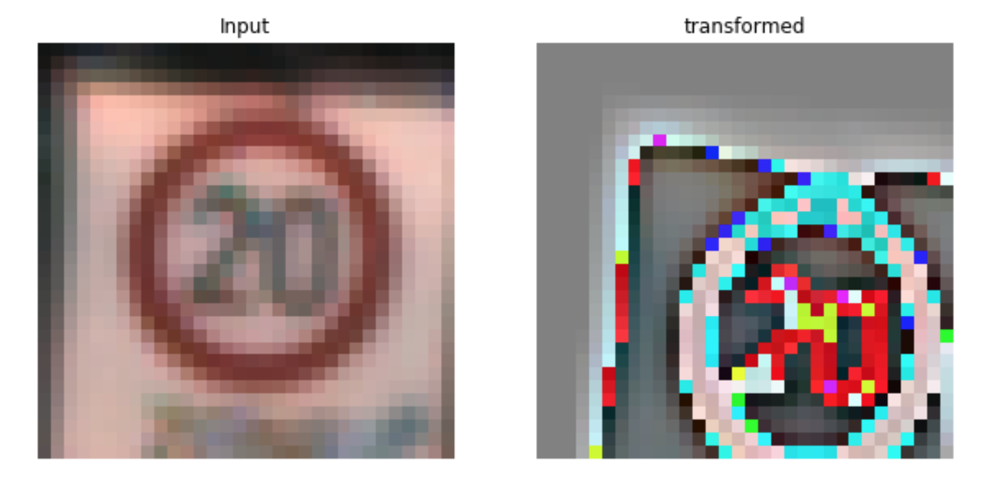
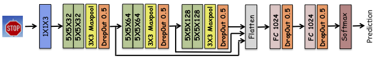
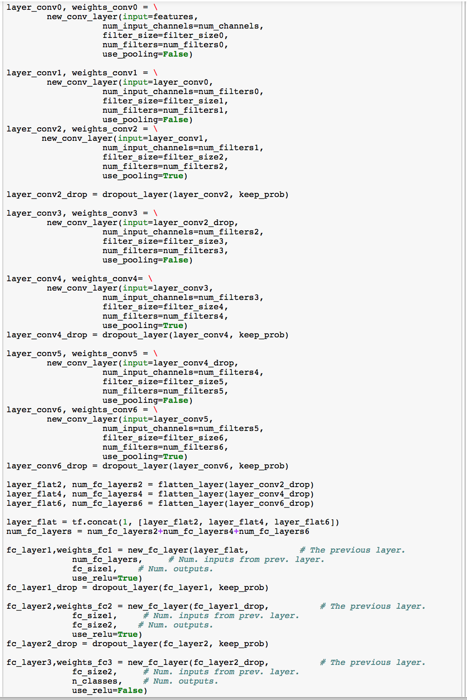
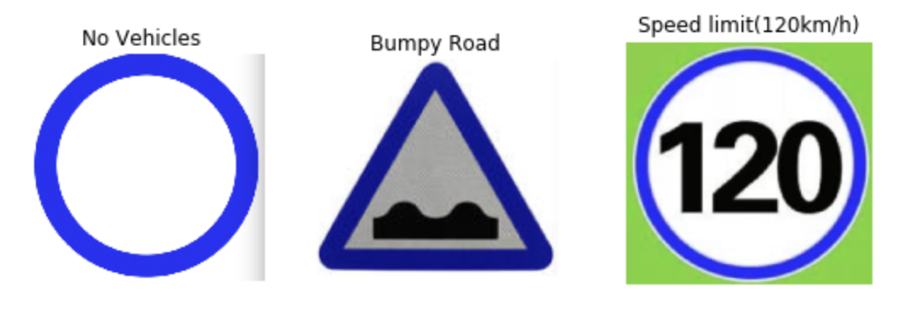
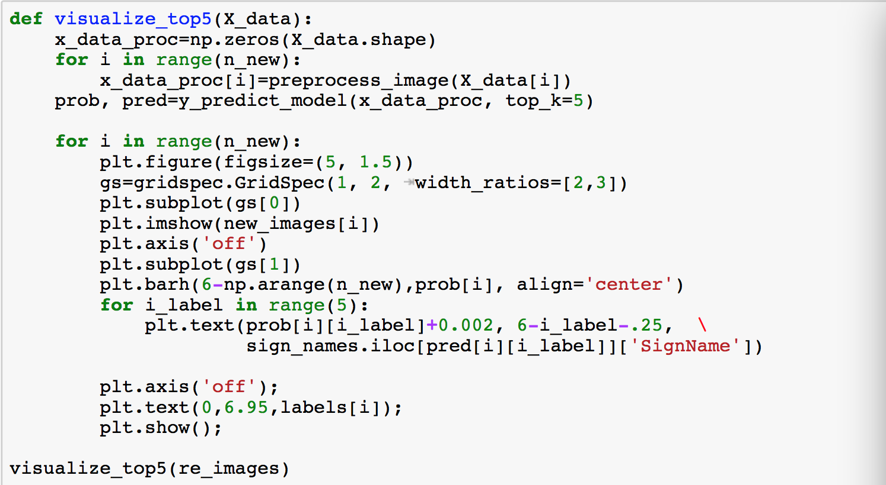
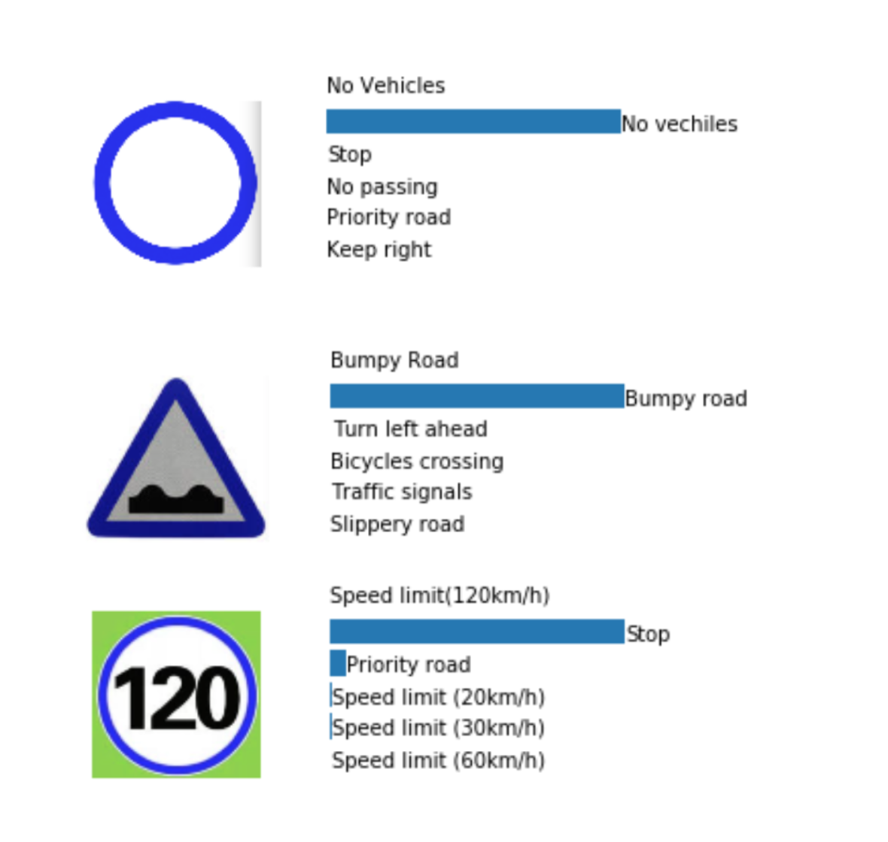

# Project 2 : Build a Traffic Sign Recognition Classifier


In this project, I used deep neural networks and convolutional neural networks to classify traffic signs. The purpose of this work is to train a convolutional model to decode traffic signs from natural images by using the [German Traffic Sign Dataset](http://benchmark.ini.rub.de/?section=gtsrb&subsection=dataset). 

### Dependencies

This project requires **Python 3.5** and the following Python libraries installed:

- [Jupyter](http://jupyter.org/)
- [NumPy](http://www.numpy.org/)
- [SciPy](https://www.scipy.org/)
- [scikit-learn](http://scikit-learn.org/)
- [TensorFlow](http://tensorflow.org)

Run this command at the terminal prompt to install [OpenCV](http://opencv.org/). Useful for image processing:

- `conda install -c https://conda.anaconda.org/menpo opencv3`

### Dataset

1. Download the dataset. You can download the pickled dataset in which we've already resized the images to 32x32 [here](https://d17h27t6h515a5.cloudfront.net/topher/2016/October/580d53ce_traffic-sign-data/traffic-sign-data.zip).

## Data Exploration

The [pickled data](train.p) is a dictionary with 4 key/value pairs:

- features -> the images pixel values, (width, height, channels)
- labels -> the label of the traffic sign
- sizes -> the original width and height of the image, (width, height)
- coords -> coordinates of a bounding box around the sign in the image, (x1, y1, x2, y2). Based the original image (not the resized version).

>Number of training examples = 39209

>Number of testing examples = 12630

>Image data shape = (32, 32, 3)

>Number of classes = 43


Here is a data visualization I created randomly pick 64 images from training data set, and I found the most common sign was **20kmph** sign.  





According to the diagram above, I found the **Speed limit (30km/h)** sign -> index **1**, **Speed limit (50km/h)** sign -> index **2** **Priority road** sign -> index **12**, **Yield** sign ->index **13** and **Keep right** sign ->index **38** have the highest occurences in this dataset

## Data Augmentation and preprocessing

I found that the occurnces of some of sign claases were pretty low, which would lead to a poor performance when we were going to feed training data into our deep model. Besides, with limited data and the number of images in each class were too much different, the **overfitting** issue would be most likely occured when training the model. Thus generating additional data samples would be a good way to balance training data set.

I applied the affine transformation to jitter sample images in different ways. I rotated the images by a number randomly generated between +/- 35 degree, shifted them by +/- 3 pixels along vertical and horizontal, and a final shearing transformation. After doing so, the image get transformed as follows. 



*--
**two steps to accomplish this mind**:
- applied histogram equalization by using cv2.equalizeHist( ) function to make them all with same lighting conditions
- scaled image between +-0.5 


# Design and Test a Model Architecture

Figure below presents the model architecture

 

- the first module is made by 3 1x1 filters. These filters have the effect of changing color maps.Since, we don't know which color map influenced the result the most,therefore by using 3 1x1 filters, I wanted to network itself end up choosing the best color map 
- the next 3 modules are comprised of 32, 64, 128 5x5 filters respectively, each was following by maxpooling and dropout. The output from each convolution layer was fed into a feedforward layer which was composed of 2 hidden layers(each layer contains 1024 nuerons).  Additional dropout layers are applied after each of the fully connected layers.
    - the last softmax layer is used to compute the log-loss of model prediction. 
    - I used Adam optimizer as it seems to automatically tune the learning rate with time.

>The idea of using **dropout** layer heavily is to avoid overfitting and force the network to learn multiple models for the same data.



---

### Training:

- Generate 64 batches per 645 images in the training set using data augmentation

- Split data into training and validation sets such that the validation set is 20% of the training set.

> *validation set* : 10320

> *training set* :  41280

- Trained total 50 epochs, with the validation accuracy of 97.4%

# Test a Model on New Images

here are some new traffic sgin images I found on web







## Reflection

As the prediction results shown above, I found **no vehicle** sign and **bumpy road** sign were easy to be recognized with nearly 100% certainty, however, the **speed limit(120km/h)** sign had really poor certainty, which implied that these 8 classes seemed to be more difficult to be identified correctly: **speed limit(20km/h)**,  **speed limit(30km/h)**, **speed limit(50km/h)**, **speed limit(60km/h)**, **speed limit(70km/h)**, **speed limit(80km/h)**, **speed limit(100km/h)** and **speed limit(120km/h)** , the number inside the circle of different speed limit classes were too similar to be classified with high certainty. 

I found my classifier worked poorly on speed limit recognition(with low probability of 20%), thus I thought collecting more data samples from classes of speed limit signs would be a good way to improve the certainty of predicting them.  


```python

```
